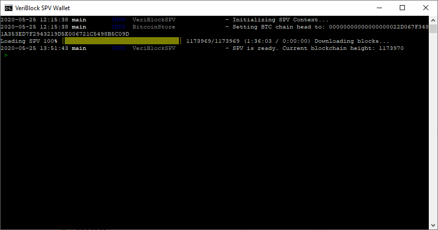

# Table of Contents
* [Overview](#overview)
* [How to Install](#how-to-install)
* [How to Run SPV](#how-to-run-spv)
* [Sample Output](#sample-output)
* [File Structure](#file-structure)
* [Known Issues](#known-issues)

# Overview

NodeCore SPV (Simple Payment Verification) is a light wallet that allows a user to see their balance and send VBK without downloading, syncing, and running a full node.

SPV can run as a separate process, and the NC_CLI can connect to an SPV node.

For convenience, a separate package is created by modifying the NC_CLI package that allows one to directly run the SPV.

# How to Install

Download BETA from here:

* https://mirror.veriblock.org/veriblock-nodecore-spv-0.4.9-dev.79.tar.gz
* https://mirror.veriblock.org/veriblock-nodecore-spv-0.4.9-dev.79.zip

Tested on OpenJDK 8, 11, 14, for Windows and Ubuntu Linux

# How to Run SPV

1. Unzip the package to its own folder
2. Run `veriblock-spv.bat` (Windows) or `veriblock-spv` (Linux/Mac)
3. Wait for the SPV to sync (generally 10 minutes for every 1 million blocks; time will vary)

This means SPV is ready:
```
SPV is ready. Current blockchain height: 1004200
```
Run `help` to see available commands
```
Commands:
    clear
    quit|leave|close|exit
    help|?|/?|h|/h|h?|showcommands
    getbalance|getbal|bal
    getstateinfo|stateinfo|state|getstate
    send|sendtoaddress|sendtoaddr
    lockwallet
    unlockwallet
    decryptwallet
    encryptwallet
    importwallet
    backupwallet
    getnewaddress
```
You can also learn what each command does in more detail with `help <command>`.

Example send command call:
```
send <amount> <destinationAddress>
```

# Sample Output


# File Structure

Running the SPV will create a "data" folder, as well as log and wallet files.

# Known Issues

This is a BETA, and there are several known issues.

* SPV does not show locked coins (from MainNet launch). If you have a locked-coin balance, SPV will still show as zero.
* Running importwallet may take a few minutes to sync the new wallet.
